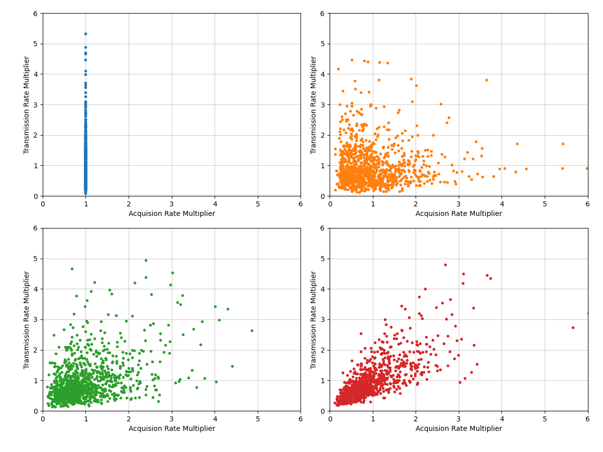
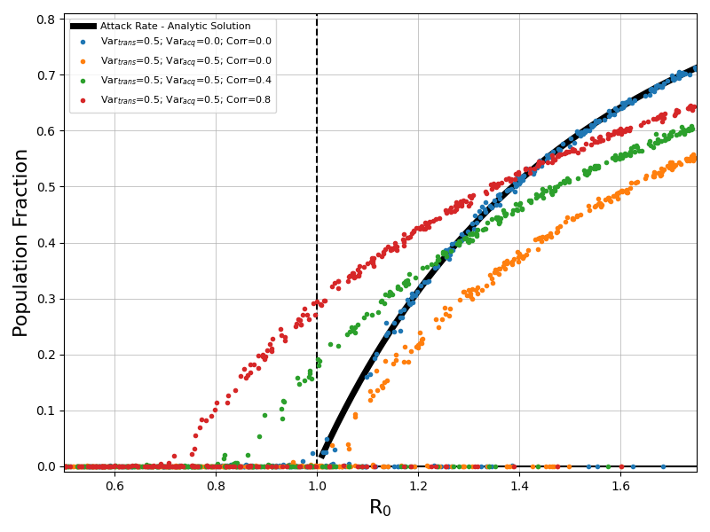

# Covariance

This example demonstrates the impact of heterogeneity on epidemic attack rate. These simulations sweep over R~0~ with fixed levels for variance in an individual's transmission rate, acquisition risk, and the covariance between transmission rate and acquisition risk.

Each simulation uses a single node of fully susceptible individuals. An outbreak is initialized by a constant importation pressure of infected individuals. There is no age structure, vital dynamics, or waning.

Example distributions for the four sets of heterogeneity examined in these simulations are shown below. Outcomes include heterogenity in transmission only, uncorrelated heterogeneity in both transmission and risk, heterogeneity in both transmission and risk with low correlation, and heterogeneity in both transmission and risk with high correlation.

​

Total attack rate of an outbreak is shown in the figure below for the four sets of heterogeneity described above. A range of infectivity (R~0~) is evaluated for each parameter set. Each dot is the outcome of a single stochastic simulation.

With only heterogeneity in transmission, the total attack rate of an outbreak follows the analytic solution from Kermack and McKendrick. Adding heterogenity for individual risk reduces the overall attack rate of an outbreak. Adding correlation between transmission and risk (positive covariance) translates outcomes to the left.

Note that for these simulations, the value of R~0~ is calculated as the average number of secondary infections that would occur from a primary infection in a totally susceptable population. The other common definition of R~0~ is based on the threshold for outbreak. These quantities are not always equivalent.
