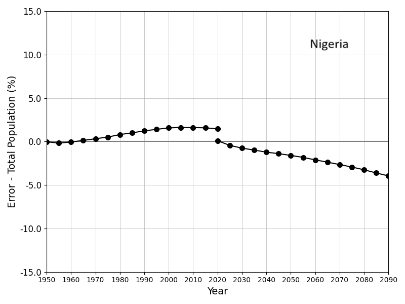

# Demographics WPP

This model demonstrates the implementation of vital dynamics (births, deaths, and aging) to reproduce data from UN World Population Prospects between the years 1950 and 2090. Simulations include no infections or contagion, and have only one node.

Outcomes below show the simulated population pyramids for Nigeria over two time periods: estimates (1950 - 2020) and median projections (2020 - 2090).

Total population remains close to its target value for multiple decades of simulated time.

Simulations do not include immigration. Mortality rates are adjusted to best match population structure, but must be non-negative. Simulated populations in countries with substantial immigration will not match UN WPP values as closely. Error in total population estimates for the United Kingdom is shown below.

Outcomes below show the simulated population pyramids for the United Kingdom over two time periods: estimates (1950 - 2020) and median projections (2020 - 2090).

Although total population is substantially below its target value, the age distributions are consistent with the WPP reference.
