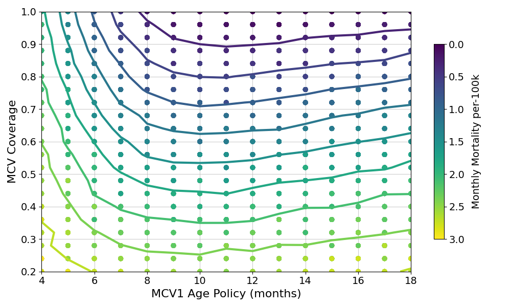
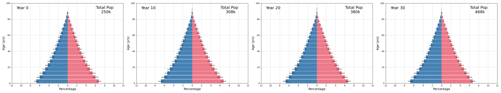
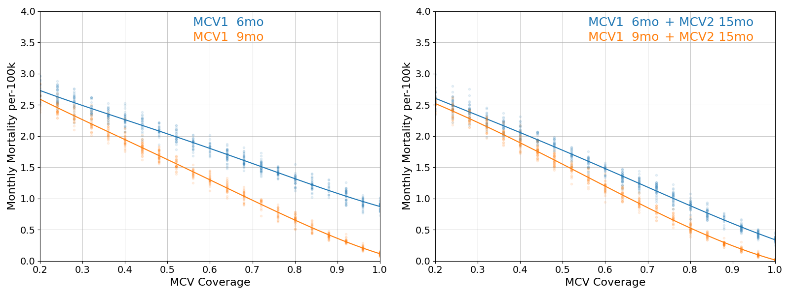
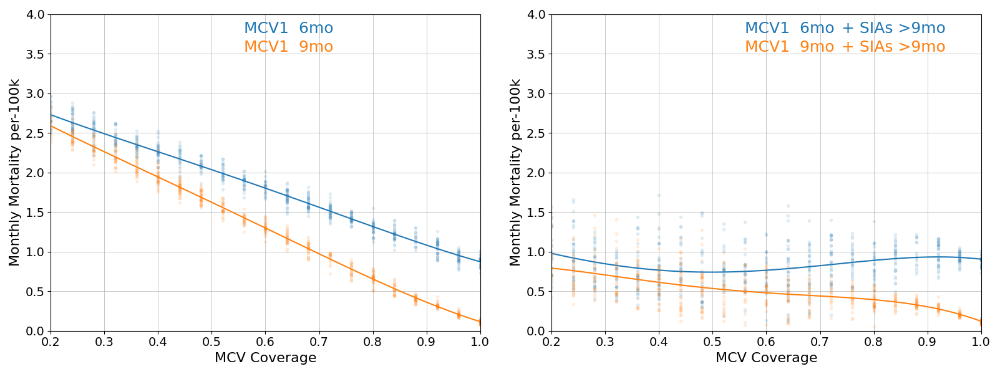

===============
model_measles01
===============

This model explores the burden of measles for various ages of MCV1 administration. Burden is calculated using a case-fatility rate around 2% for infants and declining with increased age. Age at MCV1 administration is interpreted as the policy age, with individual variation in the actual age of vaccination. Primary vaccine failure occurs in 5% of infants when vaccinated at 9 months, with increasing rates of vaccine failure at younger ages.

|
Populations are well mixed and reproduce an age distribution that is forecast for the DRC in the year 2040. The distribution is held at equilibrium for the duration of simulation.

|
When there is only one opportunity for vaccination, lower vaccine take at younger ages tends to be a greater risk than delaying vaccination and potentially leaving infants unprotected for several additional months. However, additional opportunities for vaccination beyond a single MCV1 touchpoint will affect that conclusion. Below, cross-sections from the burden figure at the 6 month and 9 month policy ages are juxtaposed with similar outcomes that incorporate MCV2 at 15 months with 50% dropout (relative to the MCV1 rates).

|
Additional vaccine doses from supplemental immunization activities (SIAs) are also a major consideration, although the frequency of those campaigns will decline with increasing routine immunization coverage. Below, cross-sections from the burden figure at the 6 month and 9 month policy ages are juxtaposed with similar outcomes that incorporate SIAs every two years when MCV1 coverage is below 50% and declining to every third, fourth, etc., year at higher MCV1 coverages. 

