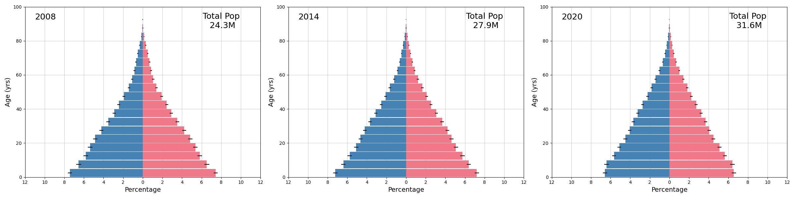
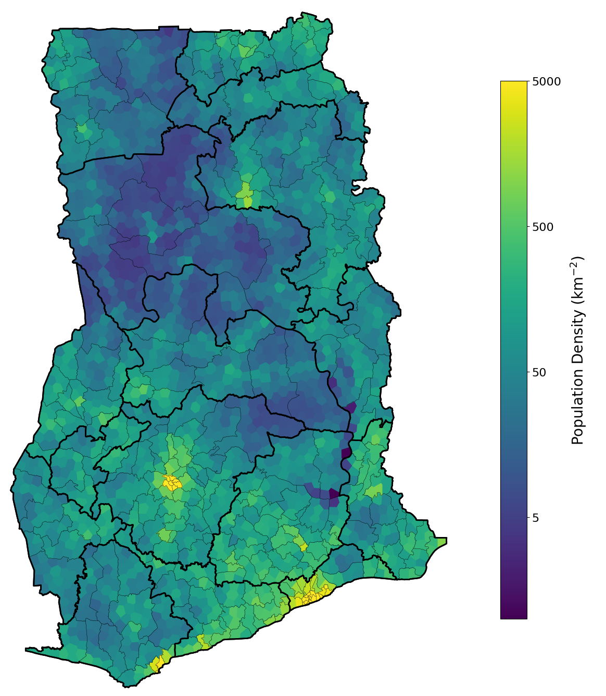

# Measles - GHA

This model explores outbreak response strategies for measles, with Ghana as an example near-elimination context. Routine coverage of MCV1 in Ghana has been around 90% for more than a decade. Coverage at this level results in occasional interruption but is not high enough to prevent periodic resurgences or outbreaks from re-importation.

UN WPP estimates for total population and population age structure were used to create a representation of the demography of Ghana.

WorldPop estimates of the spatial distribution of the population were aggregated from constrained 1km approximations to the 10km scale, with individual nodes respecting district boundaries (second administrative level). Districts smaller than 100km^2^ were not subdivided.

Measles infectivity moved between nodes based on a gravity-type network model. A spatially uniform rate of MCV1 was assumed for each region (first administrative level) based on time varying estimates of MCV1 coverage from IHME.

Each agent represented 25 individuals. Prevalence could fall to zero during the simulation, but exogeneous importation ensured long-term elimination did not occur. Importation probability was proportional to population. Simulations started in 2008. Outputs prior to 2011 were ignored because initial measles immunity is only roughly approximate and a few years of simulated time are required to establish internal consistency. Each simulation time step represents 5 days.

TO-DO:

Parameters in the baseline model were adjusted to fit observed timeseries of measles incidence. Poisson-based likelihood function is maximized over one free parameter that scales total incidence and is interpreted as a reporting rate.

Important features include:

- Acquisition-transmission covariance.
- Pre-specified calendar of supplemental immunization activities (SIAs).
- Maternally derived immunity.
- Overdispersion of the infection rate.

Test scenario projects incidence forward and implements outbreak response SIAs based on observed incidence.

Important features include:

- SQL-based event reporting of symptomatic incidence.
- Spatial varying reporting rates sampled from a beta distribution.
- Response interventions created dynamically using python in-process.
