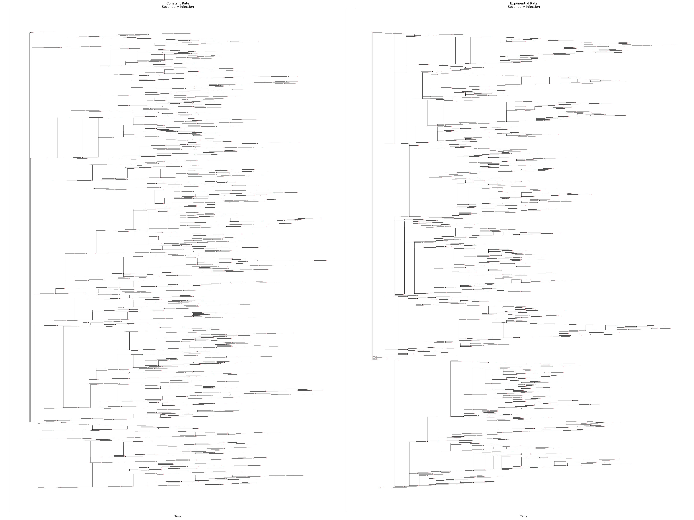

# Transmission Trees

This example demonstrates the implementation of superspreading behavior and its visualization using transmission trees. These simulations use a constant R~0~ value of 1.5 and one of two variance levels for the secondary transmission rate: constant or exponential. A constant rate has each infected individual cause secondary infections via a Poisson process with rate equal to R~0~; an exponential rate has each infected individual cause secondary infections via a Poisson process where the rate is drawn from an exponential distribution with mean equal to R~0~.

One tree diagram for each simulation is shown in the figure below:

​

Each simulation has a default network of 16 nodes (4-by-4 grid) that are well mixed using the network infectivity feature. Simulations are implemented as multi-core (two cores per simulation) to demonstrate logging and transmisssion between nodes hosted on different cores (note that cores may or may not be co-located on a common machine.)

An outbreak is initialized by a constant importation pressure of infected individuals. There is no age structure, vital dynamics, or waning. All simulations run for 1000 time steps or until total infectivity falls to zero.

Data for the explicit transmission tree is generated by applying infection labels based on the unique ID of the infecting agent. Logging is provided by the event database (SQLite format) that records these infection labels. Each record provides a unique ID for the infected agent and the unique ID for the infecting agent. Infected individuals imported to initialize the outbreak have their infecting agent's ID label set to zero.
